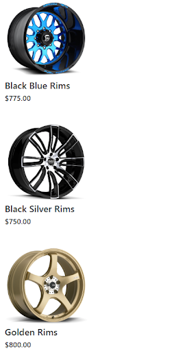

# Adding products to cart with Commerce.js using Vue.js

This guide will walk you through on how to use Commerce.js with Vue.js framework to add products into the cart. It will also go over how to remove the products, and how to change the product’s quantity.

Commerce.js v2 will be used in this guide.

[Live_Demo](https://codesandbox.io/s/vuejs-ecommerce-cart-handling-project-with-commercejs-wvi92)

## Overview

This guide continues from the end of [product listing](https://github.com/jaepass/example-cjs-vue). Check it out if you want more details.

If you haven’t done so already, create an account at Chec.io and then add products through your dashboard. In this guide, aftermarket car rims will be the products used for demonstration.

In this guide, you’ll go over:
1. A quick setup that includes installations of required packages and code for product listing.
2. Creating a product viewing page and learning about Vue’s event handling.
3. Setting up vue-router to navigate between pages.
4. Utilizing Commerce.js cart add method and showing cart adding success message. 
4. Creating a header equipped with navigation.
6. Creating a cart viewing page with subtotal and cart editing.


## Requirements

* IDE Code Editor
* NPM or yarn
* Vue JS
* Bootstrap

## Prerequisites

* Basic web development knowledge in HTML, CSS, and JS
* Some knowledge Single-page application design

## Initial Setup

1. First, pop open a terminal and install Vue globally.

``` 
npm install -g @vue/cli
```

2. Create a project using this Vue command.

```
Vue create your-project-name
```

3. You will see options on which features to include. Go ahead and select the defaults (babel, eslint). Bootstrap will be used for styling, which will be installed during the main guide.

4. Change directory to your create project

```
Cd your-project-name
```

5. Run npm install to get all the necessary dependencies

```
Npm install
```

6. Run the serve script found in package.json using NPM to boot up the local server

```
Npm run serve
```

7. Install the Commerce.js SDK

```
Npm install @chec/commerce.js
```

8. Open an IDE of your choice, and travel into your project’s directory. Travel into main.js and then copy and paste the code below.

```javascript
// App.vue
import Vue from "vue";
import Commerce from "@chec/commerce.js";
import App from "./App.vue";
 
Vue.config.productionTip = false;
 
const API_KEY = "your_api_key";
 
const commerce = new Commerce(API_KEY, false);
 
new Vue({
  render: h => h(App, { props: { commerce } })
}).$mount("#app");
```

9. Open the App.vue file and replace all the code inside with this. 

```html
<!-- App.vue -->
<template>
 <div class="container">
   <ProductsPage :products="products"/>
 </div>
</template>
<script>
import ProductsPage from "./pages/ProductsPage.vue";
export default {
 name: "App",
 props: {
   commerce: {
     type: Object,
     required: true
   }
 },
 components: {
   ProductsPage
 },
 data() {
   return {
     products: [],
     cart: []
   };
 },
 created() {
   this.commerce.products
     .list()
     .then(res => {
       this.products = res.data;
       this.commerce.cart
         .retrieve()
         .then(res => {
           this.cart = res.line_items;
         })
         .catch(err => console.log(err));
     })
     .catch(err => console.log(err));
 }
};
</script>
```

10. An error will occur because the ProductsPage component doesn't exist yet. Create a pages folder and a component folder within the src directory. Starting with the ProductsPage, create a ProductsPage.vue Inside of pages folder and then copy and paste in the following code.

```html
<!-- ProductsPage.vue -->
<template>
 <div>
   <ProductCard
     v-for="product in products"
     :product="product"
     :key="product.id"
   />
 </div>
</template>
 
<script>
import ProductCard from "../components/ProductCard.vue";
 
export default {
 name: "ProductsPage",
 components: {
   ProductCard
 },
 props: {
   products: {
     type: Array
   }
 }
};
</script>

```
11. Now create a ProductCard.vue file in the components folder, and copy and paste the code below.

```html
<!-- ProductCard.vue -->
<template>
 <div class="card-body">
   
   <h5 class="card-title">{{product.name}}</h5>
   <h6 class="card-subtitle">{{product.price.formatted_with_symbol}}</h6>
 </div>
</template>
 
<script>
export default {
 name: "ProductCard",
 props: {
   product: {
     type: Object
   }
 }
};
</script>
 
<style scoped>
div {
 width: 220px;
}
</style>
```
That was quite a bit to go through so here’s a break down to the key ideas. 

* App file fetches the products list and then fetches the user’s cart. 
* The results are stored in their respective states in the data method. 
* Products state is passed as props into the ProductsPage, and the ProductPage maps out each product with the Product component. 
* ProductCard component reveals the Product image, name, and price. Your product list will look similar to this.



The project setup should be complete, and now onwards to the main guide.

## Project Tutorial

### 1. Create Product View Page

Starting off is the creation of the product view page. The purpose of this page is to show the item in a larger and clearer view, have additional item details ,and allow customers to add the item into the cart.

The idea is to have the customer click on the product’s name or image so they can move to the ProductViewPage with their selected product in sight. This requires a set up for event handling and routing. [Event handling](https://vuejs.org/v2/guide/events.html) will be the first subject.

#### Handling events with directives and emit

Now move back into the ProductCard.vue file. In order to pass the product object as props from the ProductCard.vue file, data needs to travel upwards in the DOM tree. This is accomplished by using [$emit](https://vuejs.org/v2/guide/components-custom-events.html), a built-in Vue method that communicates from child component to parent component and can also pass data up.

Start by creating a [method](https://vuejs.org/v2/api/#methods) property inside of the export default located in the script tags. This property is where functions for use within the component can be stored. Inside of methods, create a function named onClick as this function will be called when the product is clicked. It should look like this below.

```javascript
// ProductCard.vue
 methods: {
   onClick() {
     this.$emit("viewProduct", this.product);
   }
 }
```

Whenever $emit is called, you must call it as this.$emit. All of the states and functions within the script tag must start with this., a trend that you will not see inside of the template tags later on. Pass in a string that describes the name of this event as the first argument, and the following arguments can be any data inside of the component that you want to pass up.

To make this function trigger, wrap the product’s image and name in the template with a span tag. In Vue.js, event handling is done through the use of [directives](https://012.vuejs.org/guide/directives.html). Instead of an onClick attribute, type in v-on:”event-type”=”method” instead. Below is how it should look, but with a shorthand for the v-on instead.

```html
<!-- ProductCard.vue -->
<span @click="onClick">
    
    <h5 class="card-title">{{product.name}}</h5>
</span>
```

Verify this event is working by throwing in a console.log inside of the function. A shorthand of the v-on:”event-type” is @”event-type”, a convention that will be used for the remainder of the guide.

Move into ProductsPage.vue, the parent component file that is one level above. Each following parent component will have identical processes that are meant to relay data from one another until it reaches its destination. To listen to a child component and then trigger a function, add the attribute @”emitName”=”method” in the Product tag.

```html
<!-- ProductsPage.vue -->
<ProductCard
    v-for="product in products"
    :product="product"
    :key="product.id"
    @viewProduct="viewProduct"
/>
```

The function in ProductsPage methods is very similar with a small change.

```javascript
// ProductsPage.vue
methods: {
    viewProduct(product) {
        this.$emit("viewProduct", product);
    }
```

There’s a parameter in the function to take in data passed up from the child component so it can continue traveling up.

The app.vue file is the desired parent. Create a function named “handleViewProduct” as a way to identify it as the function that will handle the purpose of the event.

```javascript
// App.vue
handleViewProduct(product) {
    this.productInView = product;
}
```

this.productInView is a state that we have yet to make. Type it out inside of the data property.

```javascript
// App.vue
 data() {
   return {
     products: [],
     cart: [],
     productInView: {}
   };
 },
```

Inside of the ProductsPage tag, add the event listener attribute.

```html
<!-- App.vue -->
<ProductsPage :products="products" @viewProduct="handleViewProduct" />
```

Console logging can verify that this setup works. Great! Now onto routing.

### 2. Routing

This is the moment where the site finally becomes a single-page application. [Routing](https://router.vuejs.org/guide/#javascript) shows customers the appropriate page for each step in the cart adding process. First, install vue-router.

```
Npm install vue-router
```

And then import it along with all the pages to route. The ProductViewPage.vue wasn’t made yet so go ahead and create the file inside of the pages folder.

```javascript
// main.js
import App from "./App.vue";
import ProductViewPage from "./pages/ProductViewPage.vue";
import ProductsPage from "./pages/ProductsPage.vue";
```

Inside of the main.js file, at the top just below the imports,tell Vue to use VueRouter like this.

```javascript
// main.js
Vue.use(VueRouter);
```
Assign a const named router to a VueRouter instance and pass in an object with a property called routes. Routes will be an array filled with objects and each object is a route that the app will have.

```javascript
// main.js
const router = new VueRouter({
 routes: [
   {
     path: "/",
     name: "ProductsPage",
     component: ProductsPage
   },
   {
     path: "/product/:productId",
     name: "ProductViewPage",
     component: ProductViewPage,
   }
 ]
});
```

Some key points from this code.
* The string in the path property will be concatenated with the site’s url so it can be accessed with the address bar.
* The term behind the colon in the path can be extracted through Vue’s $route.params.
* The name is how the router-link component directs users to the correct page.
* Component property contains the actual component.

```javascript
// main.js
new Vue({
    router,
    render: h => h(App, { props: { commerce } })
}).$mount("#app");
```

To verify the routing is working, move into the App.vue file and replace the ProductsPage tag with a [router-view](https://router.vuejs.org/api/#router-view) tag, but make sure that :products=”products” is included too. You will also no longer need to import ProductsPage into the script. Remove the import and the ProductsPage variable in the components property.

```html
<!-- App.vue -->
<div class="container">
    <router-view :products="products"/>
</div>
```

If the page renders the products list, then the router is working. Router-view can take in props just like any component. What’s different about router-view is that it takes in all props for all components linked up in routing. This is especially important for the ProductViewPage as you can now pass in the productInView as props.

```html
<!-- App.vue -->
<router-view
    @viewProduct="handleViewProduct"
    :productInView="productInView"
    :products="products"
/>
```

Move into the ProductCard.vue file so you can add the [router-link](https://router.vuejs.org/api/#router-link) component. Wrap it around the span that contains the product’s image and name and then add the following attributes. 

```html
<!-- ProductCard.vue -->
<router-link :to="{ name: 'ProductViewPage', params: { productId: product.id } }">
    <span @click="onClick">
    
    <h5 class="card-title">{{product.name}}</h5>
    </span>
</router-link>
```

The “to”  attribute is binded to the name of the route that you want to direct the customers to, and that name was also declared in the main.js file. Then there’s the params property, which is how values can be passed through [dynamically with routing](https://router.vuejs.org/guide/essentials/dynamic-matching.html). The productId key is found inside of the path for the ProductViewPage right after the colons.

```javascript
// main.js
path: "/product/:productId",
```

Moving inside the empty ProductViewPage.vue file, copy and paste below.

```html
<!-- ProductViewpage.vue -->
<template>
 <div>
   <div class="container">
     <div>
       
       <h6>Description:</h6>
       <p v-html="productInView.description"/>
     </div>
     <div class="product-info">
       <h3>{{ productInView.name }}</h3>
       <h4>{{productInView.price.formatted_with_symbol}}</h4>
       <button class="add-to-cart-button">Add to cart</button>
     </div>
   </div>
 </div>
</template>
 
<script>
export default {
 name: "ProductViewPage",
 props: {
   productInView: {
     type: Object
   }
 }
};
</script>
 
<style scoped>
img {
 width: 500px;
}
.container {
 display: flex;
}
.product-info {
 margin-top: 50px;
 margin-left: 50px;
}
 
.product-info p {
 margin-top: 10px;
}
.add-to-cart-button {
 background: dodgerblue;
 border: none;
 color: white;
 padding: 10px 20px;
}
</style>
```

And the end result.


### 3. Adding product to cart

The main idea of the guide is finally here. While the journey to get here was long, routing and event handling will serve as valuable skills that you will frequently utilize as you further develop your eCommerce site.

With the given layout for the ProductViewPage, the next step is to have the blue “add to cart” button handle adding the product to the cart. The steps to this will look very similar to what you did early on. Attach an on-click event listener on the button.

```html
<!-- ProductView.vue -->
<button @click="addProductToCart" class="add-to-cart-button">Add to cart</button>
```

Next is the function emitting this event. The function name is given above and will look very similar once again.

```javascript
// ProductView.vue
 methods: {
   addProductToCart() {
     this.$emit("addProductToCart", this.productInView);
   }
 }
 ```

Continue emitting until you get to the App.vue file. Fortunately, the file is the immediate parent component so in the App.vue file, create the event listener.

```html
<!-- App.vue -->
   <router-view
     :products="products"
     @viewProduct="handleViewProduct"
     :productInView="productInView"
     @addProductToCart="handleAddProductToCart"
   />
```

In the handler function named “handleAddProductToCart”, use commerce to do an API call much like the one early on, but instead of the retrieve method, use the add method and then pass in the product id.

```javascript
// App.vue
   handleAddProductToCart(product) {
     this.commerce.cart
       .add(product)
       .then(res => {
         console.log(res)
         this.cart = res.cart.line_items;
       })
       .catch(err => console.log(err));
   },
```

Your handle function will look like this. Upon clicking, take a look into your console and check if you got an object showing if the item add was successful. This post request will return an updated cart in its response so assign it to the cart state.


#### Showing cart adding success

This is good news, but news that only the developer could see. There should be a way to let customers know if their item was successfully added to the cart. Having a status state would be one way to handle this. Inside of the App.vue file, add status inside of the data property.

```js
// App.vue
 data() {
   return {
     products: [],
     cart: [],
     productInView: {},
     status: undefined
   };
 },
```

Pass status down as a prop to ProductViewPage by passing it into router-view.

```html
<!-- App.vue -->
   <router-view
     :products="products"
     @viewProduct="handleViewProduct"
     :productInView="productInView"
     :status="status"
     @addProductToCart="handleAddProductToCart"
   />
```

In ProductViewPage.vue, you can tell the component what type of props to expect inside of the props property. ProductInView props is already there, now add in a status props

```javascript
// ProductViewPage.vue
   status: {
     type: String
   }
```

This is one way for the child component to receive props. There’s another way that is shorter and not type-sensitive. Set props as an array with the props names as strings instead of objects.

```javascript
// ProductViewPage.vue
props: ["productInView", "status"]
```

Place the status inside of the template via text interpolation. Place it just below the “add to cart” button as customers' eyes should be fixed around that area already.

```html
<!-- ProductViewPage.vue -->
<p>{{ status }}</p>
```

The status prop is linked from parent to child components, all there’s left for this to work is to set the status when cart adding is successful. Back in App.vue inside of “handleAddProductToCart” function, you can replace the console.log call with this.status = “success message”

```javascript
// ProductViewPage.vue
this.status = "Item successfully added to cart";
```

Give it a try! After a second or two, a message should appear right below the button.


If you view a different product, you’ll notice that the status message will linger around. A quick fix would be to set this.status = undefined inside of the handleProductView function in app.vue.

```javascript
// App.vue
   handleViewProduct(product) {
     this.productInView = product;
     this.status = undefined;
   },
```

### 4. Setting up a header for navigation

The ProductViewPage is accessible, but customers can’t get out of it unless they delete the “/product/:productId” inside of the address bar. This is clearly not user-friendly so you’ll have to make a header with navigation features 

Create Header.vue inside of the components folder. There isn’t too much to learn about this step so go ahead and copy and paste this inside.

```html
<!-- Header.vue -->
<template>
   <nav>
       <router-link to="/">Home</router-link>
       <router-link to="/cart">Cart</router-link>
   </nav>
</template>
 
<script>
export default {
 name: "Header"
};
</script>
 
<style scoped>
nav a {
   margin-right: 10px;
}
</style>
```

Make sure you import the component into the App.vue file and then add it into the component property.

```javascript
// App.vue
import Header from "./components/Header";

 components: {
   Header
 },
```

There’s a link to the cart page you haven’t made yet. The next section will go into that.

Give it a try and see if you can flip back between the ProductsPage and the ProductViewPage.

### 5. Create a page to view cart

So far the app can add items to the cart and verify its success. Now you’ll create one last page that will provide customers a page to change the item’s quantity or to remove an item from the cart. 

Create a file in the pages folder named “CartPage.vue”. Inside of the file, copy and paste this in.

```html
<!-- CartPage.vue -->
<template>
 <div>
   <CartItem
     v-for="product in cart"
     :product="product"
     :key="product.id"
     @updateItemQuantity="updateItemQuantity"
     @removeItem="removeItem"
   />
 </div>
</template>
 
<script>
import CartItem from "../components/CartItem.vue";
 
export default {
 name: "CartPage",
 components: {
   CartItem
 },
 props: {
   cart: {
     type: Array
   }
 },
 methods: {
   updateItemQuantity(id, quantity) {
     this.$emit("updateItemQuantity", id, quantity);
   },
   removeItem(id) {
     this.$emit("removeItem", id);
   }
 }
};
</script>
```

As seen above, there’s a component named CartItem that you have yet to make. Create a CartItem.vue file inside of components and then copy and paste this in.

```html
<!-- CartItem.vue -->
<template>
 <div class="card-body">
   <div>
       
       <h5 class="card-title">{{product.name}}</h5>
       <h6 class="card-subtitle">Price: ${{product.price.formatted_with_symbol}}</h6>
   </div>
   <div>
       <h5>Quantity: {{ product.quantity }}</h5>
       <h6>Update item quantity</h6>
       <input @input="onChange" type="number" step="1" min="1">
       <button @click="updateItemQuantity">Update</button>
       <button @click="removeItem" class="remove-button">Remove Item</button>
   </div>
 </div>
</template>
 
<script>
export default {
 name: "CartItem",
 props: {
   product: {
     type: Object
   }
 },
 data() {
     return {
         quantity: 1
     }
 },
 methods: {
     onChange(e) {
         this.quantity = e.target.value
     },
     updateItemQuantity() {
         this.$emit("updateItemQuantity", this.product.id, this.quantity )
     },
     removeItem() {
         this.$emit("removeItem", this.product.id)
     }
 }
};
</script>
 
<style scoped>
div {
 width: 220px;
 margin-right: 50px;
}
 
div input {
   width: 50px;
}
.card-body {
   display: flex;
   width: 100%;
   align-items: center;
}
.remove-button {
   border: none;
   background: none;
   color: dodgerblue;
   margin-top: 50px;
}
</style>
```

Most of the event-listeners and functions are included. The step-by-step instructions will be skipped because there’s not too much new knowledge to absorb. Instead, here are the key points:

* CartPage iterates through the cart items and creates a CartItem component for each product with the product’s props pass down.
* CartItem component has two event listeners: input and click. Customers select the quantity they want on the input, and can submit with the “Update” button
* Input event changes quantity state accordingly and click events emits data upwards to App.vue file for the commerce instance to use.

The pages and components are ready, but are not hooked up yet to the router. Move to main.js and add the route just like the other pages.

```javascript
// main.js
   {
     path: "/cart",
     name: "CartPage",
     component: CartPage
   }
```

Pass in the cart state in App.vue into the router-view.

```html
<!-- App.vue -->
   <router-view
     :products="products"
     @viewProduct="handleViewProduct"
     :productInView="productInView"
     :status="status"
     @addProductToCart="handleAddProductToCart"
     :cart="cart"
   />
```

#### Show cart's subtotal

There’s one additional step that’s going to be more hands-on. Customers would like to see their subtotal (total price before tax, shipping, discounts, etc) price when they check their cart. Being able to see price change when quantity changes improves user’s experience.

Create a [computed](https://v1.vuejs.org/guide/computed.html) property inside of CartPage.vue export default object. Because text interpolation can only handle simple operations, computed provides space for more complex operations.

To get the subtotal, use the [reduce](https://developer.mozilla.org/en-US/docs/Web/JavaScript/Reference/Global_Objects/Array/reduce) array method on the cart array. 


```javascript
// CartPage.vue
   cartTotal() {
     return this.cart.reduce(
       (acc, currentEl) => acc + currentEl.quantity * currentEl.price.raw, 0);
   }
```

Reduce takes in a callback function with two parameters: Accumulator (acc) and currentElement (currentEl). Each element it iterates through is added to acc. Acc is carried over for each iteration. Each element is a product from the cart so you can access its price and quantity.

Add the computed value into your template.

```html
<!-- CartPage.vue -->
   <div>
     <hr>
     <h3 class="subtotal">Cart Subtotal: $ {{ cartTotal }}</h3>
   </div>
```

If you added items into your cart, your result will look like this.


#### Updating the Cart

The copied code should already have emits included, all there’s left is to have the App.vue file to listen to them.

Inside of the App.vue, add event listeners into the router-view componen and then link them to handler functions.

```html
<!-- App.vue -->
   <router-view
     :products="products"
     @viewProduct="handleViewProduct"
     :productInView="productInView"
     :status="status"
     @addProductToCart="handleAddProductToCart"
     :cart="cart"
     @updateItemQuantity="handleUpdateItemQuantity"
     @removeItem="handleRemoveItem"
   />
```

Now go ahead and create these functions.

```javascript
// App.vue
   handleUpdateItemQuantity(id, quantity) {
     this.commerce.cart
       .update(id, { quantity })
       .then(res => {
         this.cart = res.cart.line_items;
       })
       .catch(err => console.log(err));
   },
   handleRemoveItem(id) {
     this.commerce.cart
       .remove(id)
       .then(res => {
         this.cart = res.cart.line_items;
       })
       .catch(err => console.log(err));
   },
```

Both of these functions are very similar to adding product to cart. Update method takes in the product’s id string and an object with the quantity amount. Remove method only needs the product id. Both requests will return an updated cart upon successful calls, which you will bind to the cart state to update the customer’s cart.

Try changing the quantity input and see if it works.


## And that's it!

Going from listing products to adding the products to cart is a huge step due to the higher level of interactivity. Fortunately, the lessons learned in this guide will provide a solid foundation for the implementation of Comemrce.js checkout process, which is the next step in building a complete eCommerce site.
